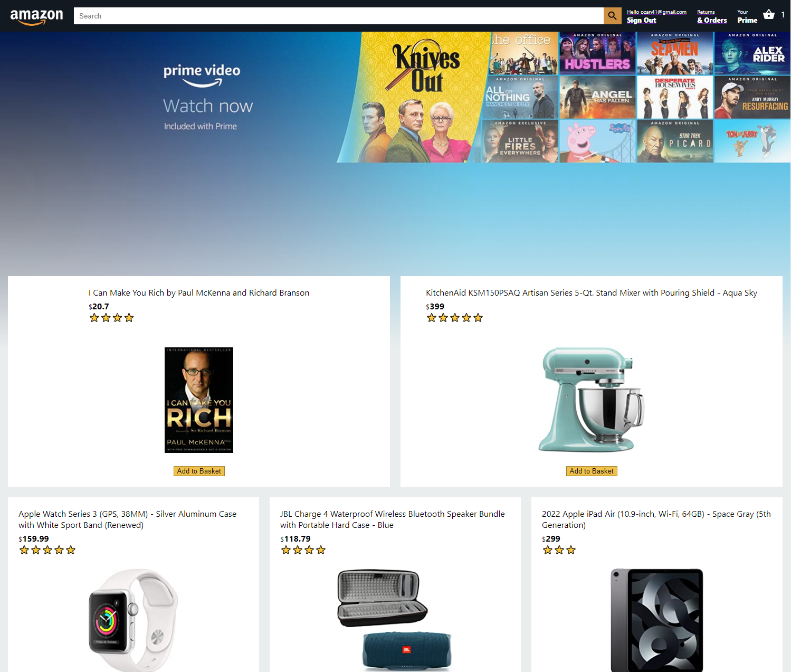

# Amazon-Clone

Check project ,live Link  : https://amzn-clone-ozngrsc.web.app/

## Topics

- ReactJS
- Firebase's Firestore realtime Database
- Build checkout/ payment page with stripe functionality
- Complete the checkout screen with the React context API
- Build Login Page with full login functionality (sign up and sign in) with firebase authentication
- Deploy cloud function to process payment (servesless)
- Store orders for logged in user
- Material UI
- React Hooks
- Flexbox
- React Flip Move
- Responsive Design
- Deploy the App LIVE on Firebase

## Author

Yash Dhamak
yashdhamak2002@gmail.com

